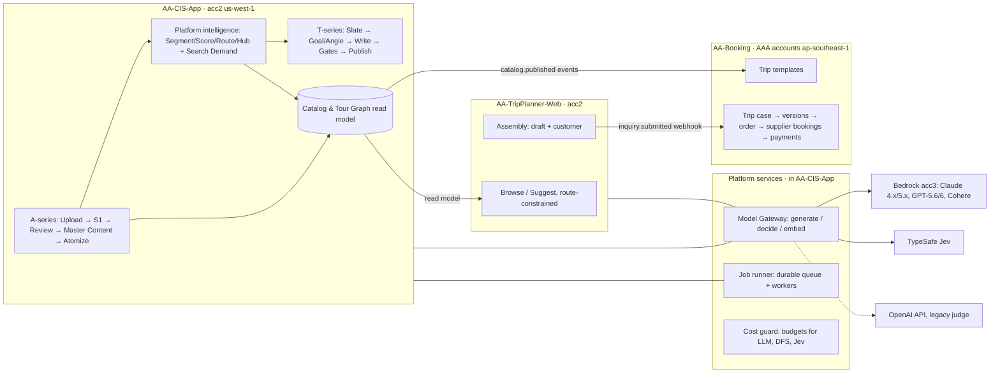

# AA-Ecosys — Architecture Review & Target Plan (September 2026)

> **Status:** proposal for review (S199, 28/09/2026). Decisions that still need Nghiệp's sign-off are
> marked **[DECISION]**. Facts verified in this session are marked **[FACT]** with their source;
> anything inferred but not yet proven is marked **[HYPOTHESIS]**.
> Companion ADR: [`docs/adr/0001-ecosystem-target-architecture.md`](../adr/0001-ecosystem-target-architecture.md).

## 1. Scope and method

Input: the 28/09/2026 meeting with Ms. Thư (CIS-App, TripPlanner, AA-Booking, ecosystem integration),
plus S198's Jev / model research (Linear AA-642..645).

Evidence gathered in this session (read-only unless stated):

- Code on `main` of all three repos (App `fa062bc`, TripPlanner `b60d14e`, Infra `594f8d6`) and the
  repo `CONTEXT.md` files.
- Live Dev database through ECS exec (read-only queries).
- AWS Bedrock model catalog and model-access status on acc1/acc2/acc3 (no model was invoked).
- AAA source documents in `docs/AAA/` (PRD, ERD, Quanskill handover review, Figma exports).

## 2. Current state snapshot

### 2.1 Data (Dev RDS, 28/09/2026) [FACT]

| Object | Count |
|---|---|
| `raw_tours` | 793 (India 257, China 119, Japan 104, Nepal 71, Laos 58, Thailand 41, Taiwan 36, Bhutan 35, South Korea 30, Sri Lanka 25, Mongolia 17) |
| `generated_content` | 185 |
| `published_tours` (not trashed) | 121 (11 countries) |
| `tour_atoms` | 9,208 |
| `atom_segment` / distinct places | 3,463 / 2,222 |
| `route` | 325 |
| `search_demand` rows | 19,785 |
| tenants | 4 (`aa_internal`, `wanderlux-travel`, `exploreasia-co`, `test-1`) |

The rerun described in epic AA-594 has not happened yet. The Master Content pool is partial: 121 of
the 763 tours eligible for S1 have been published.

### 2.2 Spend, last 30 days [FACT — `shared.llm_call_log`, `shared.dfs_call_log`]

| Source | Calls | USD |
|---|---|---|
| DataForSEO, **25/09 alone** | 1,169 live calls | **49.02** |
| `t5_atomize` Sonnet 4.6 (before AA-619 moved it to Haiku) | 998 | 19.22 |
| `a3_search_demand` Haiku 4.5 (the LLM research loop) | 7,856 | 10.27 |
| `s1_generate` / `s1_flag_fix` / `s1_itinerary_nudge` Haiku (satellite) | 1,324 | 6.18 |
| `s1_judge` GPT-4.1 (OpenAI API) | 362 | 1.42 |
| `t2_generate` Sonnet 4.6 | 25 | 1.72 |

### 2.3 Model access on Bedrock [FACT — `get-foundation-model-availability`, 28/09/2026]

| Model | acc3 (primary) | acc1 (fallback) | acc2 |
|---|---|---|---|
| GPT-6 Astra (`openai.gpt-6-astra`) | ✅ agreement + authorized | ❌ agreement not accepted | ❌ |
| GPT-5.6 Luna (`openai.gpt-5.6-luna`) | ✅ | ❌ | ❌ |
| Claude Sonnet 5 (`anthropic.claude-sonnet-5`) | ✅ | ❌ | ❌ |
| Claude Opus 5.5 (`anthropic.claude-opus-5-5`) | ✅ | ❌ | ❌ |
| GPT-6 Luna (`openai.gpt-6-luna`), S198's target | ❌ agreement not accepted | ❌ | ❌ |

All of these are exposed only through inference profiles (`us.*` and `global.*`).

## 3. Findings (most severe first)

### F1 — DataForSEO spend is uncapped and scoped wrongly (**P0 bug**) [FACT]

- `api/routers/v1_tours.py::_run_research_only()` runs `run_segment_research()` after **every tenant
  T2 rewrite**.
- `services/acp_contract/segment_research.py::run_segment_research()` loads
  `SELECT canonical_place, canonical_action FROM acp_contract.atom_segment` with **no filter**, and then
  researches every place that is stale for the tenant's buyer markets.
  - The function's docstring still says "the tenant's current Segments". That was true before AA-545;
    since AA-545 made Segments platform-wide, the same query covers the whole platform (2,222 places).
- Result on 25/09: two bursts, at 05:xx and 08:xx UTC (563 and 605 live calls), across AU/US/UK.
  - The bursts line up with the S196 test rewrites for WanderLux.
  - Cost: `search_volume_bulk` $39.24, `keywords_for_keywords` $9.00, `serp_advanced` $0.84, plus
    ~7.9k Haiku research calls.
  - This drained the $50 top-up in one day.
- There is **no scheduler** behind it. The daily Lambda only reads the DFS balance.
- What is missing:
  - a per-run and per-day DFS budget;
  - a pre-run cost estimate;
  - an admin-owned trigger — today a tenant click triggers a platform-wide purchase.

### F2 — Long-running work runs as in-process `asyncio` tasks [FACT, consequence partly HYPOTHESIS]

- The T2 rewrite, T9 write, segment research and A3 atomize all run through `asyncio.create_task`
  inside the API container.
  - There is no durable queue, no retry and no reaper.
  - A deploy or task restart kills the work. ECS `stopTimeout` is 90 s, but a long tour takes
    105–207 s.
- [HYPOTHESIS] The "tour finished but still shows Writing" bug Ms. Thư reported has two possible causes:
  - A version row stays `status='pending' AND edit_source='ai_generated'` after its task died. The
    portal derives "Writing…" from exactly that condition (`CatalogTab.isAiWriting`), and 18 PRs were
    deployed on 25/09 while test writes were running.
  - Or the portal poll never refreshes the list after completion.

  The DB has no stuck rows today, because the WanderLux test data was cleaned. This must be reproduced.
- Bedrock Batch (AA-606) is still blocked by AWS (AA-624). The meeting decided to use **async batch**
  (our own queue) instead.

### F3 — The model layer cannot use the new models [FACT]

1. **IAM.** `AA3-Bedrock-Invoker` (`infra/.../acc3-bedrock/main.tf`) allows only Sonnet 4.6 and
   Haiku 4.5. Sonnet 5, Opus 5.5 and the GPT models are denied from ECS today.
2. **Request format.** `LLMClient` builds Anthropic-native bodies (`anthropic_version`,
   `invoke_model_with_response_stream`). OpenAI models on Bedrock need the **Converse API** (or the
   OpenAI chat body).
3. **Hardcoded routing.**
   - Model tiers are hardcoded strings (`haiku` / `sonnet` / `gpt-4.1`).
   - The admin UI controls only `s1_brand_audit`.
   - `brand_fit.py` and `judge_client.py` hardcode GPT-4.1 (S198).
4. **Fallback.** The acc3 → acc1 fallback does not work for any new model, because acc1 has not
   accepted the agreements.

### F4 — Admin and Tenant UI: duplicated structure, thin pages [FACT]

**Admin navigation**

- Two "Dashboard" entries: "ACP v2 — Setup & Approval" and "AA Internal Content".
- Legacy route group `(internal)/{catalog,upload,brand,review}` duplicates `/admin/*`.
- Brand Identity is a top-level page, separate from Settings.
- Platform Stats and Tenant Activity overlap: both report pieces and gates per tenant.
- The "ADMIN" tag on nav items adds noise and does not reflect a real permission difference.
- The `content` role has no JWT; the cookie is trusted as-is (AA-253 is still open).

**Tenant admin page** (`/admin/tenants`)

- A list plus a detail view with 6 tabs (tours, pipeline, activity, api, brand, social_content).
- Missing: an overview/health view, markets and channels, usage/quota/cost-to-serve, integrations
  (WordPress, API keys), a quality view (gate telemetry per tenant), an audit trail, and lifecycle
  actions.

**External Spend** (`/admin/llm-usage`) should become **Cost Operations**. It needs budgets and alerts,
not only reporting.

**Tenant portal**

- Account pages (Activity, Billing, Settings) are single components in `PlaceholderTabs.tsx`.
- My Content is a list, not a table.
- The Social Content wizard expands inline under the Slate, so the tenant has to scroll to find it.
- T9 asks for a CTA with a 422 when the tenant has none configured, which adds an extra step after the
  Angle is chosen.

### F5 — TripPlanner suggestions are not constrained to tours we sell [FACT]

- `backend/assembly/suggestions.py` ranks the next place by 0.6 × taste (pgvector) + 0.4 × distance.
- It is limited to countries already in the trip, but nothing checks that the chosen places belong to
  **one real tour route**. A traveller can build a trip that no AA tour can fulfil.
- The data needed to fix this already exists:
  - `tripplanner.itinerary_components` has `source_tour_id` and `source_day_index`;
  - CIS `acp_contract.route` holds 2–5-day spans.
- `itinerary_components` is not refreshed after CIS publishes. It must be rebuilt after the rerun.

### F6 — AA-Booking (AAA) is not started, and its contract with the ecosystem is undefined [FACT]

- The PRD/ERD (Quanskill, 09/06/2026) has open P0 gaps. The handover review (10/06) lists them:
  - media convention;
  - `supplier_bookings`;
  - how trip_plan links to destination;
  - multi-country trips;
  - audit / soft-delete columns;
  - supplier bills;
  - payment schedule.
- **Update 28/09 (Nghiệp):** AAA is built **from scratch** — only the PRD, ERD and Figma exist. It runs
  on the **existing acc2 infrastructure**: same RDS, new schema `booking`, no separate account or region.
  The old AAA accounts (ap-southeast-1) are closed and out of scope.

### F7 — Documentation debt [FACT]

- READMEs are one line in App (`# AA-CIS Application …`) and Infra (`# AA-CIS Infrastructure — Terraform`).
- Root docs (`README.md`, `ecosystem-architecture.md`, `tripplanner-to-aaa-handoff.md`) are in
  Vietnamese. That breaks the language convention: everything on GitHub is English except session logs.
- `apps/AA-CIS-App/.claude/CLAUDE.md` LIVE STATE was last updated 25/08/2026 (task def :133, migration
  115). It is badly stale: today it is :348+ and migration 167.
- The `CONTEXT.md` files do not yet describe the cross-repo contracts (catalog, handoff, model gateway,
  jobs).

### F8 — Jev is available but not yet measured [FACT]

- The key exists locally (`secret_manager/`, gitignored).
- The smoke test (`docs/research/jev/jev_smoke.py`) has not run against the real API. Sending the key
  to an external endpoint needs Nghiệp to run it himself.
- Ms. Thư's own measurement: **51% agreement with human labels**, uncalibrated floor. Jev must go
  through offline evaluation and shadow mode before it gates anything.

## 4. Target architecture

Principles, each recorded as a decision in ADR 0001:

1. **CIS is the content system of record.** TripPlanner and AAA consume a **Catalog & Tour Graph read
   model**. They never read the CIS pipeline tables directly.
2. **One Model Gateway** for every LLM, Jev and embedding call, in both CIS and TripPlanner:
   - a DB catalog of models;
   - routing per stage, with fallback and shadow;
   - the Bedrock Converse API;
   - a cost log for every call.
3. **All long work runs on a durable job runner:** rewrite, write, research, atomize, rerun and
   extraction. Progress stays on the existing Redis snapshot (ADR 0004).
4. **Every external spend passes through a cost guard** (DFS, LLM, Jev):
   - a budget per run and per day, held in the DB and editable in Settings;
   - a hard stop when exceeded;
   - an alert.
5. **Apps talk by contracts, not shared tables:**
   - versioned events or webhooks with HMAC signatures and idempotency keys;
   - an outbox table on the sender side.
6. **One design system** (tokens + components) shared by Admin, Portal, TripPlanner and AAA.

## 5. CIS-App recommendations

### 5.1 Model strategy (acc3 only for new models)

| Role | Today | Target candidate | Gate before switching |
|---|---|---|---|
| Tour/post writer (`t2_generate`, `t9_write`, `t8_angle_gen`) | Sonnet 4.6 | **Sonnet 5** | A/B on 20 real tours per AA-645: brand-fit, grounding, cost |
| Admin writer / atomize | Haiku 4.5 | keep Haiku 4.5 | — |
| Judges (`s1_judge`, brand audit, Debate brand-fit, T10 F8/F9) | GPT-4.1 on the OpenAI API | **GPT-5.6 Luna** (cheap tier) or **GPT-6 Astra** (quality tier) on Bedrock acc3 | AA-644 A/B: agreement with the current judge, determinism (temperature/seed support), cost |
| Offline evaluation / gold labels for Jev calibration | — | **Opus 5.5** (eval only, never on the hot path) | Budget per eval run |
| Structured yes/no/choice decisions | LLM judges and regex | **Jev** (shadow first) | AA-643 offline eval vs human labels |

- Judges stay on a different vendor (OpenAI) from the writer (Anthropic). That property is kept.
- Moving judges from the OpenAI API to OpenAI-on-Bedrock removes a second billing and key path.
- Get real per-token prices for Astra and 5.6 Luna from the Bedrock pricing page before the A/B. They
  are not assumed here.

**Fallback [DECISION]:**

- (a) Accept the model agreements on acc1 too, so acc3 → acc1 keeps working.
- (b) Fall back within acc3 to the previous model (Sonnet 5 → Sonnet 4.6, GPT-5.6 Luna → GPT-4.1 on
  OpenAI).

Recommendation: **(b) now, (a) later.** (b) needs no new agreements, and the Gateway expresses both.

**Prerequisites:**

- Infra PR: add the new model ARNs (all three ARN forms, as for the existing models) and `bedrock:Converse*`
  coverage to `AA3-Bedrock-Invoker`.
- App: a Converse provider in the Gateway.

### 5.2 Durable async jobs (replaces Bedrock Batch for now)

- **[DECISION]** Recommended: a **Postgres-backed queue** (`shared.job`) plus a **worker ECS service**
  (same image, different command).
  - Claims use `SELECT … FOR UPDATE SKIP LOCKED`.
  - Idempotency key per `(kind, subject_id, attempt)`.
  - Retry with backoff.
  - A reaper marks jobs stuck longer than their TTL as `failed`.
  - A concurrency cap per provider.
- SQS is the alternative. It is not needed at the current volume and adds infra.
- The API only enqueues and returns a `job_id`. The portal and admin read job status, not inferred row
  states. This fixes F2 by design.
- An admin **Jobs** page lists runs, progress, cost so far, and has cancel/retry.

### 5.3 Clean rerun, synchronised A/T flow, with Jev

1. **Freeze and fix** (before any rerun):
   - F1 DFS scope bug and budget guard;
   - the Gateway Converse provider and IAM;
   - the job runner;
   - AA-641 (flag_fix must not create new hard failures).
2. **Flow audit.** Walk A0 → A3 → Segment/Score/Route → Slate → T8–T11 on one small country (Bhutan,
   35 tours), checking every hand-off. Make sure:
   - every stage reads the platform-wide sets and never recomputes a platform set per tenant;
   - DFS is bought only by an **admin-triggered, budgeted research job** — never by a tenant action;
   - progress, cost and state are visible in admin.
3. **Jev in shadow.** Run Jev beside the current check at the stages in §5.4, write every probability
   to `decision_log`, and gate nothing yet.
4. **Rerun in country waves** through the job runner: Bhutan → the small countries → India/China/Japan.
   - Each wave has a budget and a verification checklist (AA-599/600/601).
   - TripPlanner re-extraction runs after each wave.
5. **Promote Jev** only for gates where the offline eval clears the agreement threshold agreed with
   Ms. Thư.

### 5.4 Where Jev fits (priority order)

| # | Stage | Question type | Expected gain |
|---|---|---|---|
| 1 | A3 search-demand research: "is this keyword really about this place/activity?" **before buying DFS** | Noul | Direct DFS and Haiku savings. This was Ms. Thư's ticket 03 |
| 2 | Score / Questions: "does this PAA question land on this segment/country?" | Noul | Replaces loose token matching (ticket 04/05) |
| 3 | T10 F8/F9 warn-level brand-voice / generic-AI gates | Noul/Score | Replaces GPT-4.1 on non-blocking gates |
| 4 | Debate brand-fit | Score | Replaces a GPT-4.1 call (cached per brand version) |
| 5 | T3 grounding second opinion on regex hits | Noul | Fewer full-tour rewrites from false positives. Needs citations (open ADR question) |
| 6 | A3 atom classification fields; TripPlanner extraction (activity, intensity, duration) | Choice | Cheaper than LLM JSON extraction |
| 7 | A0 column mapper | Choice | Low volume, low priority |

- Not a fit: free-text generation (writer, angles). Jev cannot return strings.
- Guardrails:
  - offline eval against human labels;
  - calibrated thresholds per question;
  - shadow mode;
  - every call logged with cost;
  - a DPA/ZDR agreement before tenant content is sent to TypeSafe.

### 5.5 Admin UI v2 — information architecture

| Section | Pages | Merges / removals |
|---|---|---|
| **Overview** | System dashboard: pipeline health A0→A3, rerun waves, jobs, tenants activity, cost MTD vs budget, alerts (DFS balance, fallbacks, stuck jobs) | Merges the two dashboards |
| **Content** | Upload · Rewrite (S1, **with streaming**) · Review Queue · Master Content | Removes the legacy `(internal)` routes |
| **Intelligence** | Atoms · Segments · Scores · Routes & Hubs (tabs of one page) | Keeps the current Social Content sections |
| **Tenants** | Tenant list · **Tenant 360** (see below) · Tenant activity and quality | Merges Platform Stats and Tenant Activity into the tenant area |
| **Operations** | **Cost Operations** (LLM, DFS, Jev, AWS bill, budgets, alerts) · **Jobs** | Renames External Spend |
| **Settings** | Models per stage · AA brand identity · Integrations (DFS, WordPress defaults, Jev, keys status) · Budgets & limits · Markets · Users & roles | Brand Identity moves here. The "ADMIN" tag is removed |

UI standard, shared across all pages:

- a `DataTable` (TanStack Table): column filters, sort, column toggle, pagination, saved views, CSV
  export;
- a right-side detail `Drawer`;
- a confirm `Modal`;
- empty, loading and error states;
- page header with breadcrumbs and actions.

All of these are built on the brand tokens in `frontend/app/_brand/tokens.ts`.

**Tenant 360 page** — header: name, plan, status, markets, channels, health score, last activity.
Tabs:

1. **Overview** — KPIs: tours rewritten, pieces, published, quota used/overage, cost to serve vs
   revenue, alerts.
2. **Profile & Brand** — full brand identity with version history, CTA defaults, forbidden words,
   examples.
3. **Tours** — the tenant's catalog versions (table), rewrite history.
4. **Social Content** — Slate state per channel, pieces (table), gate outcomes.
5. **Channels & Integrations** — WordPress connection health, publish log, API keys (rotate/revoke),
   rate limit.
6. **Usage & Billing** — quota meter, overage, invoices (once billing exists), LLM/DFS cost by stage.
7. **Quality** — gate telemetry and held/failed reasons for this tenant (moved from Platform Stats).
8. **Audit** — timeline of admin and tenant actions.
9. **Settings** — plan, RPM, markets, activation/deactivation, danger zone.

### 5.6 Tenant Portal v2

- **Navigation:** Home · Tours (Browse / My Tours tabs) · Social Content · My Content · Brand ·
  Marketplace · Account (Billing, Activity, Team & Settings, API, Integrations).
  - Publish becomes an action on My Content, plus Integrations under Account.
- **Writing experience** (tour and social):
  - Choosing a Segment/Topic opens a **right-side Writer panel**: Goal → Angle → writing starts
    **automatically**, with live streaming (ADR 0004) and step progress.
  - The CTA comes from the tenant's Brand defaults, so the flow never stops to ask.
  - Tour rewrite uses the same panel.
  - The status comes from the job (`queued`/`writing`/`checking`/`done`/`failed` with retry), not from
    row inference.
- **My Content:** a DataTable with columns for title, channel, place/topic, goal, angle, status
  (ready/published), words, created, and actions (view, export, publish). Filters for channel, status
  and date; sortable.
- **Marketplace:** a catalog grid with filters (country, duration, activity), a detail drawer, and a
  clear "add to my catalog" state.
- **Account:**
  - Billing: plan card, usage meter, overage and history. **[DECISION]** a payment provider is out of
    scope until chosen.
  - Activity: a filterable audit timeline.
  - Settings: profile, CTA defaults, markets, notifications, team members.

## 6. TripPlanner recommendations

### 6.1 Route-constrained planning (the core change)

1. **Tour Graph read model**, built from CIS published tours by the extraction job after each rerun
   wave:
   - nodes = `shared.destinations`;
   - edges = consecutive days in the same `source_tour_id` (from `itinerary_components.source_day_index`),
     weighted by the number of tours;
   - each node also carries activities, country, intensity and season.
2. **Feasibility invariant:** the set of pinned destinations must be covered by **at least one real
   tour**. Allowing a small combination of tours in one country is a **[DECISION]**; the default is one
   tour.
   - The UI only offers places that keep the trip feasible.
   - Places that would break it are hidden, or greyed with the reason "no AA tour covers this
     combination".
3. **Suggest next:** among graph neighbours of the last stop that keep the trip feasible, rank by
   taste (existing pgvector) and distance (existing).
   - This is deterministic SQL: no LLM, cacheable in Browse.
   - Jev is optional, only as a Score for "fits the trip intent" among the feasible candidates.
4. **Filters:** country, activity (8-category taxonomy), intensity, duration. All become indexed WHERE
   clauses (`backend/browse/filters.py` pattern).
5. **Output:** a draft always carries the matching `source_tour_id`(s). The advisor in AAA then starts
   from a real template, not a blank itinerary.

### 6.2 Hand-off to AA-Booking (finalises `tripplanner-to-aaa-handoff.md`)

- **Transport — option A:** a signed webhook with an outbox on the TripPlanner side.
  - HMAC-SHA256 signature header.
  - `Idempotency-Key = draft_id + revision`.
  - Retry with backoff; a dead-letter view.
- **Payload v1:**
  - customer (with consent flag and timestamp);
  - draft days and components;
  - matching `source_tour_id`s → AAA `trip_plan` external refs;
  - narration;
  - `schema_version`.
- AAA creates a `trip_case` with status **New Inquiry**, linked to the template of the best-matching
  tour, and pre-fills V1 from the draft.
- **Identity:** AAA owns the customer identity (OTP). TripPlanner's `registration.py` becomes a client
  of the AAA identity API once it exists. Until then, dedupe on email/phone.

## 7. AA-Booking (AAA) — how to start

1. **Close the ERD P0 gaps first**, per the handover review:
   - media as `s3_bucket` + `s3_key` (or a `media_files` table);
   - `supplier_bookings` and supplier bills;
   - `payment_schedule`;
   - `trip_plan` → destination(s) (M:N);
   - multi-country via `trip_case_countries` / `trip_plan_countries`;
   - enum for `trip_case` status;
   - `created_at` / `updated_at` / `deleted_at` everywhere;
   - `audit_logs`;
   - **new for the ecosystem:** `external_ref` (`source_system`, `source_id`) on `trip_plans`,
     `activities`, `destinations`, `countries`, so catalog sync is idempotent.
2. **Repo and infra:**
   - new repo `AA-Booking` under `AdventureAsia365-Ecosys`;
   - Terraform in AA-CIS-Infra as new roots `accounts/aaa-{dev,stg,prod}` — one IaC repo for the whole
     ecosystem;
   - same OIDC pattern.
   - **[DECISION] stack:** recommended FastAPI + Postgres + Next.js, the same as CIS, so the team reuses
     CI, auth patterns, the design system and the Model Gateway client. If Quanskill has already
     delivered code in another stack, evaluate it first.
3. **Catalog sync (CIS → AAA):**
   - CIS emits `catalog.tour.published|updated|trashed` from an outbox. AAA upserts `trip_plans`
     (templates), `activities` and `destinations` by `external_ref`.
   - AAA content creators then enrich templates with prices, hotels and suppliers. CIS never writes
     commercial data.
4. **Inquiry intake:** the webhook endpoint from §6.2, then Trip Case → Versions → Approved →
   Supplier bookings → Invoices/Payments, following the PRD.
5. **MVP order:**
   - auth (OTP) + RBAC;
   - catalog sync + template admin;
   - inquiry intake + trip case/versions;
   - supplier bookings;
   - invoices/payments;
   - notifications;
   - audit.

## 8. Ecosystem integration, UI/UX and infrastructure

| Area | Today | Target |
|---|---|---|
| Contracts | Implicit, shared tables | Versioned JSON contracts in `docs/contracts/` (catalog events, inquiry webhook), plus a contract test in each repo |
| Identity | CIS admin JWT + a trusted `content` cookie; tenant JWT; TripPlanner edge key | Fix AA-253 (JWT for every staff role). AAA owns customer identity. Service-to-service HMAC |
| Design system | CIS tokens in `_brand/tokens.ts`; TripPlanner Tailwind; AAA Figma | One token source (Style Dictionary → TS tokens + Tailwind preset), published as a small package consumed by all FEs |
| Observability | `llm_call_log`, `dfs_call_log`, CE snapshots | Add `decision_log` (Jev) and `job` tables. Cost Operations shows all spend sources against budgets |
| Infra | AA-CIS-Infra for acc1/2/3 | Also AAA accounts. Invoker IAM kept in sync with the Gateway model catalog |
| Docs | Mixed language, thin READMEs | README (setup/run/deploy) + CONTEXT (domain/boundaries) per repo, all in English. Root docs translated |

## 9. Phased plan and execution order

| Phase | Goal | Contents (existing issues → new proposals) |
|---|---|---|
| **P0 — Stop the bleeding** (now) | No more surprise spend or stuck state | New: DFS research scope fix + budget guard. Jev smoke test (Nghiệp runs it). AA-641 |
| **P1 — Platform foundation** | Can run the new models and long jobs safely | AA-642 Gateway P0–P1 (Converse provider, model catalog, stage routing, acc3 IAM). AA-644 / AA-645 A/B. New: durable job runner + Jobs page; AA-621/AA-624 repointed to it. New: docs/README/CONTEXT in English |
| **P2 — Flow sync + Jev shadow** | One correct, observable A→T flow | New: A/T flow audit on Bhutan. AA-643 Jev offline eval → shadow + `decision_log` |
| **P3 — Clean rerun** | Full Master Content + intelligence | AA-594 / AA-599 / AA-600 / AA-601 in country waves via jobs, with budgets |
| **P4 — UI v2** (design can start in P1) | Commercial-grade admin and portal | New: Admin IA, Tenant 360, Cost Operations, Settings merge, Portal IA + Writer panel + My Content table + Account pages + Marketplace |
| **P5 — TripPlanner v2** | Only sell what we can deliver | New: Tour Graph, route-constrained suggest + filters, re-extraction job, AAA hand-off webhook |
| **P6 — AA-Booking** | Start AAA on solid contracts | New: ERD v2, repo/infra bootstrap, catalog sync, inquiry intake, identity |
| Later | — | AA-628 feedback loop (needs published content). AA-160 notifications (reuse the event outbox). AA-634 folded into AA-643 |

P4 and P6 can run in parallel with P2/P3, because they touch different code. P5 depends on P3 data.

## 10. Decisions taken 28/09/2026 (Nghiệp) — these supersede the earlier proposals above

| Topic | Decision | Effect on this document |
|---|---|---|
| Judge model | **GPT-5.6 Luna** on Bedrock acc3. Model routing lives in its own layer (AA-642) | §5.1: Luna replaces "Luna or Astra" |
| Accounts | **acc3 is primary** for the new models. acc1/acc2 lack some agreements | Fallback within acc3 first, then acc1 only for models it has |
| TripPlanner | **Multiple tours may be combined** into one trip, producing a complete Trip Case | §6.1: "legs" (day-spans of real tours) chained at junctions, replacing "one tour" |
| AA-Booking | From scratch, **same acc2 infra, same RDS, schema `booking`** | §6.2/§7: in-database transactional outbox, no cross-region webhook. Golden records (`shared.*`) are reused, not copied |
| Jev thresholds | Needs research | AA-661: calibration study + 3-zone policy (pass / abstain → Luna / fail) |
| Job runner | Explained. Postgres queue + worker recommended | AA-650 / AA-651 / AA-652 |

### 10.1 DFS deep-dive (S199, answers Ms. Thư's "is the batch/cache working?")

1. **Trigger bug (AA-646).** Every tenant rewrite researched the whole platform (2,215 places × AU/US/UK on 25/09).
2. **Batching ineffective (AA-648).**
   - 678 volume tasks averaged **4.5 keywords** (max 13), at a flat ~$0.057–0.059 per task.
   - DFS prices per task; one task accepts up to 1,000 keywords.
   - Ms. Thư's reference ran 16 workers as a standalone batch; ours used 4 concurrent places with a 5 s linger.
3. **Cache poisoning (AA-647).**
   - The balance ran out around 09:00 UTC. From 09–10h, **14,691** `search_demand` rows were stored with NULL volume, and 1,795 places were marked "researched" for 182 days with no data bought.
   - 18,214 of the 19,305 rows written that day are NULL.
   - Cause: `fetch_volumes_bulk()` swallows errors.
4. **No budget (AA-649).** Only a balance alert existed.
5. **Standard (queued) DFS mode** fits this non-urgent work (Ms. Thư: "not urgent, batch is fine"). Use it for research jobs; keep Live for interactive calls.

### 10.2 Jev smoke test (real API, 28/09)

Model `jev-1.13.0`, ~270 ms per call:

| Question | Good piece | Bad piece |
|---|---|---|
| brand_fit | 0.79 | 0.04 |
| generic_ai | 0.09 | 0.97 |
| cta_clear | 0.88 | 0.01 |

Classification was correct: atom → trek 1.00; TripPlanner → trekking 0.84 / strenuous 0.91.

Separation is strong on clear cases. Thresholds for borderline content still need the calibration study (AA-661).

### 10.3 Issue map (created 28/09)

| Phase | Issues |
|---|---|
| P0 DFS + cost | AA-646, AA-647, AA-648, AA-649 (parent AA-616) |
| P1 Foundation | AA-650, AA-651, AA-652 (jobs); AA-654 (docs); AA-655 (design system); AA-656 (staff auth) |
| P1 Model layer (AA-642) | AA-657 (acc3 IAM), AA-658 (Converse + catalog), AA-659 (routing/fallback/shadow), AA-660 (Jev decide + decision_log), AA-661 (Jev thresholds); AA-644 (Luna A/B), AA-645 (Sonnet 5 A/B) |
| P2–P3 Flow + rerun | AA-653 (Bhutan pilot + runbook) → AA-594/599/600/601 |
| P4 CIS UI v2 | AA-662 (UI kit) → AA-663, AA-664, AA-665, AA-666, AA-667 (admin); AA-668, AA-669, AA-670, AA-671, AA-672 (portal) |
| P5 TripPlanner | AA-673 (Tour Graph), AA-674 (multi-tour composition), AA-675 (re-extraction), AA-676 (hand-off to Booking) |
| P6 AA-Booking | AA-677 (ERD v2), AA-678 (bootstrap), AA-679 (catalog sync), AA-680 (identity), AA-681 (trip case), AA-682 (operations), AA-683 (UI spec) |

## 11. Remaining open questions

1. Judge target: GPT-5.6 Luna or GPT-6 Astra (or split by gate criticality)?
2. Fallback policy: accept the agreements on acc1, or fall back within acc3 to the previous model?
3. Job runner: Postgres queue + worker service (recommended) or SQS?
4. TripPlanner feasibility: one tour only, or combinations of tours within one country?
5. AAA stack and vendor: did Quanskill deliver code? Does AAA follow the CIS stack?
6. Jev promotion threshold (agreement vs human labels) and the DPA/ZDR status with TypeSafe.
7. Billing provider for the tenant portal (Stripe or invoice-only) — needed for the Billing page.
