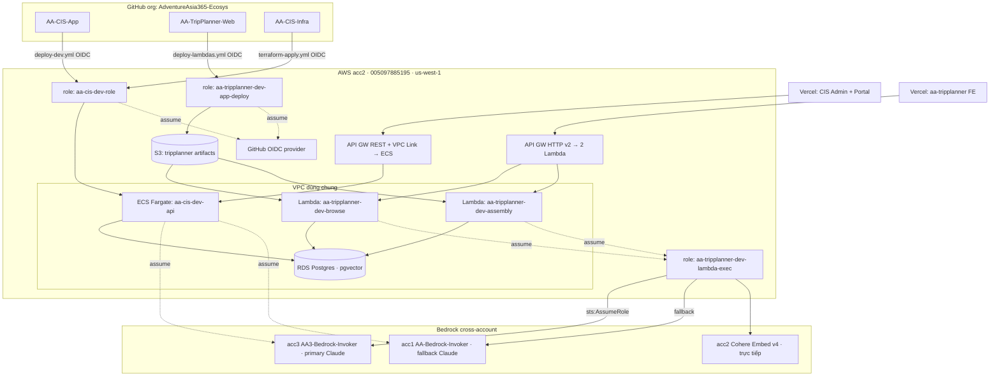

# AA-Ecosys — Kiến trúc hệ sinh thái (bản nháp)

> **Trạng thái:** cập nhật 25/09/2026 (đồng bộ công việc 15–25/09, S181–S196). Các mục đánh dấu
> **[FACT]** đã xác minh bằng đọc code/migration trong repo; **[CẦN XÁC NHẬN]** là suy luận/khoảng trống
> cần Nghiệp xác nhận.

## 1. Tổng quan

AA-Ecosys là một **multi-repo**: mỗi app deploy độc lập, gom chung một thư mục local `~/projects/AA-Ecosys/`,
tất cả nằm dưới org GitHub `AdventureAsia365-Ecosys` (đổi tên từ `AdventureAsia365-CIS`).

| Thư mục local | Repo GitHub | Vai trò | Deploy |
|---------------|-------------|---------|--------|
| `apps/AA-CIS-App` | `AA-CIS-App` | FastAPI backend (CIS core + ACPv2 T-series) + Admin frontend + Tenant Portal | ECS Fargate (api) + Vercel (frontend) |
| `apps/AA-TripPlanner-Web` | `AA-TripPlanner-Web` | B2C web app: browse điểm đến + lập kế hoạch chuyến đi (Next.js FE + 2 Lambda BE) | Vercel (FE) + Lambda (BE) |
| `infra/AA-CIS-Infra` | `AA-CIS-Infra` | Terraform — VPC, RDS, ECS, Lambda, API GW, OIDC, Bedrock cross-account | GitHub Actions (aa365 root) + human/MFA (acc1/acc3 roots) |

**Nguyên tắc ranh giới [FACT]:** *App owns code, Infra owns resources.* Ví dụ rõ nhất là TripPlanner —
`infra/AA-CIS-Infra/accounts/aa365/tripplanner.tf` tạo 2 Lambda từ một zip placeholder 209 byte; repo
`AA-TripPlanner-Web` mới build code thật và đẩy qua `lambda:UpdateFunctionCode` (Terraform `ignore_changes`
phần code nên không ghi đè). Nguồn: `docs/implementation-notes/AA-TripPlanner-backend.md`.

## 2. Sơ đồ hệ thống

## 3. Phân vai schema database (RDS dùng chung, acc2)

Cả CIS và TripPlanner dùng **cùng một RDS Postgres** trong VPC acc2, nhưng **schema tách bạch hoàn toàn**.

### 3.1 CIS — mô hình medallion + multi-tenant RLS [FACT]

Nguồn: `infra/AA-CIS-Infra/modules/rds/migrations/003_schema_v3.sql`, `apps/AA-CIS-App/api/migrations/*`.

| Schema | Vai trò | Phạm vi |
|--------|---------|---------|
| `shared` | Bảng nền tảng: tenants, brand rules, seo config, api usage | Platform-wide |
| `silver_aa_internal` / `gold_aa_internal` | Medallion cho tenant nội bộ `aa_internal` (Master Content) | Platform (sentinel tenant) |
| `silver_{id}` / `gold_{id}` | Medallion tạo động mỗi khi thêm tenant mới | Per-tenant |
| `acp_contract` | Atom / Segment / Ranking / Route / Hub / Search Demand | Hỗn hợp (xem 3.2) |
| `acp_shared` | Subject (Slate) / Piece / Gate / Facts / tenant_config / marketplace | Hỗn hợp |
| `acp_deliver` | Trang giao cho tenant (`tenant_tour_pages`) | Per-tenant |

Cô lập tenant bằng **RLS** (`SET LOCAL app.tenant_id` mỗi transaction) và, nơi có nguy cơ trùng khoá,
bằng cách **gấp `tenant_id` vào chính identity** của row (vd `segment_id = sha256(tenant_id, place, action)`).

### 3.2 CIS — Master Content (platform-wide) vs Tenant Content [FACT]

Nguồn: `apps/AA-CIS-App/CONTEXT.md` (bảng Ownership AA-540).

- **Master Content (Admin, A-series):** tính **một lần, dùng chung** mọi tenant. Gồm A0 Upload → A3
  Master Content Pool (`gold_aa_internal.published_tours`) + **Atom** (`owner_scope='platform'`).
- **Dữ liệu dẫn xuất platform-wide:** **Segment / Score / Route / Hub** — đã chuyển platform-wide từ
  AA-545 (migration 146, 06/09/2026), không còn cột `tenant_id`. Score = rank-sum 4 chiều (Demand /
  Recurrence / Questions / Said, AA-610), mỗi buyer market 1 lượt.
- **Tenant Content (T-series):** từ **Slate** trở đi — Slate / Subject / Goal / Angle / Piece / Publish —
  **per-tenant**. Slate có thêm tầng **Debate** (AA-631: contested + brand-fit, advisory, không cắt quá 50%).

**Phần dùng chung giữa các tenant [FACT]:**

1. **Master Content pool + Atom pool** — nguồn dùng chung mọi tenant đọc trực tiếp (không phải cache).
2. **Segment / Score / Route / Hub** — row platform-wide.
3. **Search Demand + research log** — cache thật, khoá `(keyword, market)`/`(place, market)`, **không có cột
   `tenant_id`**; từ AA-631 lưu thêm `serp_domains`.
4. **Facts Entry `scope='platform'`** — chia sẻ có chủ đích, cưỡng chế bằng RLS.

Ngoài ra 1 **cross-tenant read (không cache):** Gate cannibalization F10 so embedding Piece với mọi tenant khác.

### 3.3 TripPlanner — schema riêng biệt [FACT]

Nguồn: `apps/AA-TripPlanner-Web/migrations/001_tripplanner_schema.sql`.

- Schema `tripplanner` **độc lập hoàn toàn** với CIS, bật `pgvector`.
- Có phụ thuộc thứ tự migration `shared` với CIS (`002_shared_destinations.sql` phải áp trước vì FK) —
  **[CẦN XÁC NHẬN]** phối hợp đánh số migration `shared` giữa 2 app (nêu trong `docs/smoke-test-runbook.md`).

## 4. Data contracts

### 4.1 Frontend ⇄ Backend

| Cạnh | Contract | Nguồn |
|------|----------|-------|
| CIS FE (Vercel) ⇄ CIS API | REST qua API GW (REST + VPC Link) → ECS. Auth: JWT tenant + admin secret | `AA-CIS-App/.github/workflows`, CONTEXT.md |
| TripPlanner FE (Vercel) ⇄ BE | BFF Next.js gọi 2 URL Lambda qua API GW HTTP v2: `ANY /browse/{proxy+}` → browse, `ANY /trip/{proxy+}` → assembly. Env `BROWSE_API_URL`/`TRIP_API_URL` | `tripplanner.tf`, `docs/vercel-setup.md` |

### 4.2 Ranh giới app/infra (deploy contract) [FACT]

- **TripPlanner:** Infra tạo Lambda từ placeholder zip; App build + `UpdateFunctionCode`. Terraform
  `ignore_changes` code attrs. Bucket artifacts `aa-tripplanner-dev-lambda-artifacts-<acct>`.
- **CIS:** Infra tạo ECS/RDS/API GW; App build image → ECR → cập nhật ECS service.

### 4.3 Bedrock (cross-account) [FACT]

Nguồn: `docs/implementation-notes/AA-TripPlanner-backend.md`, `accounts/acc1-bedrock`, `accounts/acc3-bedrock`.

- **Embeddings (Cohere Embed v4):** acc2 gọi trực tiếp `bedrock:InvokeModel`, không satellite.
- **Claude:** acc2 KHÔNG gọi trực tiếp được → `sts:AssumeRole` sang **acc3 (primary)** / **acc1 (fallback)**.
  - acc3 role `AA3-Bedrock-Invoker`, ExternalId `aa296-satellite-bedrock-acc3`.
  - acc1 role `AA-Bedrock-Invoker`, ExternalId `aa296-satellite-bedrock`.
- Trust cross-account tham chiếu **role ARN** `aa-tripplanner-dev-lambda-exec` (KHÔNG dính tên GitHub) →
  đổi tên org không ảnh hưởng các trust này.
- Role satellite chỉ trust **ECS task role** → không gọi Claude từ máy local được; đo/A-B thật phải chạy qua
  ECS exec trong container `api`.
- **Model theo stage (CIS) do DB quyết** (`shared.llm_role_config`): S1 admin + atomize = Haiku 4.5,
  T2 tenant rewrite = Sonnet (AA-620), judge = GPT-4.1 (OpenAI, khác vendor có chủ đích).
- **Bedrock Batch (AA-606):** S3 prefix `batch-*/s1-rewrite/*` + batch service role acc1/acc3 đã có đủ, NHƯNG
  AWS **chưa bật Batch Inference cho acc3** (case 178979743800653, blocker AA-624) → chưa chạy job thật lần nào.

### 4.4 Giám sát chi phí (cross-account) [FACT]

Nguồn: epic AA-616 (AA-617/618/619/620/622/623/625/627/635), `infra/AA-CIS-Infra/CONTEXT.md`.

- **Ước tính theo token:** `shared.llm_call_log` (có account acc1/acc3, provider, fallback) +
  `shared.dfs_call_log` (cost thật DFS trả về, cache hit). Cache DFS TTL 7 ngày.
- **Hoá đơn thật AWS:** acc2 là **member account**, không phải payer của AWS Organizations → không có lệnh
  Cost Explorer gộp. Mỗi account có role đọc CE riêng (`AA-CostExplorer-Reader` acc1,
  `AA3-CostExplorer-Reader` acc3), ECS task role acc2 assume sang; acc2 gọi CE trực tiếp. Snapshot lưu ở
  `shared.cost_explorer_snapshot`, refresh tay qua `POST /admin/cost-explorer/check`.
- **Trang admin "External Spend"** (`/admin/llm-usage`): so ước tính vs hoá đơn thật, tách Bedrock khỏi hạ
  tầng theo từng account, lọc theo khoảng ngày.
- **Cảnh báo số dư DFS:** Lambda `aa-cis-dev-dfs-balance-check` + EventBridge Scheduler hằng ngày (group
  `aa-cis-dev-acp`).

## 5. OIDC / CI-CD (điểm rủi ro #1 của restructure)

| Role | File | sub hiện tại | Repo dùng |
|------|------|--------------|-----------|
| `aa-cis-dev-role` | `accounts/aa365/cicd.tf` | `repo:AdventureAsia365-Ecosys*/*:*` (org-wide, có `*` sau tên org do "include repo ID in subject") | AA-CIS-App, AA-CIS-Infra |
| `aa-tripplanner-dev-app-deploy` | `accounts/aa365/tripplanner.tf` | `repo:AdventureAsia365-Ecosys*/AA-TripPlanner-Web*:*` (có `*` do "include repo ID in subject") | AA-TripPlanner-Web |

**Nguyên tắc đổi tên an toàn:** mở rộng trust để chấp nhận **cả** org cũ **và** org mới (additive) **TRƯỚC**,
đổi tên org **SAU**, gỡ trust cũ ở bước cuối. Role ARN trong workflow lấy từ `secrets`/`vars`, tên tài
nguyên dùng prefix `aa-cis-*`/`aa-tripplanner-*` (độc lập tên GitHub) → chỉ phần khớp `sub` chịu ảnh hưởng.

> **[FACT — G5 hoàn tất 21/09/2026, AA-588]** Trust org cũ `AdventureAsia365-CIS` đã gỡ khỏi cả 2 role;
> `sub` giờ chỉ khớp org mới `AdventureAsia365-Ecosys` (verify live qua `aws iam get-role`).
>
> **Đính chính fact OIDC (kiểm qua CloudTrail 21/09/2026, AA-588):** org `AdventureAsia365-Ecosys` **CÓ**
> bật "include repo ID in the subject" (precheck trong doc g5 ghi "org KHÔNG bật" là **SAI**). `sub` thật
> có dạng `repo:AdventureAsia365-Ecosys@<orgid>/<repo>@<repoid>:<ref>`, nên trust **bắt buộc** dùng wildcard
> sau tên org: `cicd.tf` → `repo:AdventureAsia365-Ecosys*/*:*`, `tripplanner.tf` →
> `repo:AdventureAsia365-Ecosys*/AA-TripPlanner-Web*:*`. Pattern phẳng `repo:AdventureAsia365-Ecosys/*:*`
> (không `*`) **fail AccessDenied** — đã tái hiện qua CI Terraform Plan #94, fix + apply + CI xanh lại.

## 6. Nợ / mở rộng tương lai

- **AA-Booking (AAA):** sản phẩm B2C mới, sẽ thêm repo `AA-Booking` sau. Điểm bàn giao TripPlanner → AAA:
  xem `docs/tripplanner-to-aaa-handoff.md`.
- **[CẦN XÁC NHẬN]** CloudFront trước các route browse của TripPlanner (nêu là "later change").
- **Rerun dữ liệu CIS (epic AA-594):** DB Dev đã reset dẫn xuất ngày 16/09 (giữ 793 raw tours). G4/G5/G6
  (AA-599/600/601 — chạy lại S1 → atomize → social, rebuild extraction TripPlanner, audit UI) chưa chạy; phụ
  thuộc AA-624 (Batch acc3) hoặc quyết định chạy đồng bộ.

## 7. Nguồn tham chiếu

- `apps/AA-CIS-App/CONTEXT.md` — Repo Context (stack/deploy/ranh giới) + glossary + bảng
  Ownership/cross-tenant (AA-540).
- `apps/AA-TripPlanner-Web/CONTEXT.md` — Repo Context: B2C map planner, Next.js FE + 2 Lambda
  (browse stateless/cacheable, assembly stateful+Bedrock), trip event-sourced, schema `tripplanner.*`.
- `infra/AA-CIS-Infra/CONTEXT.md` — Repo Context: mô hình 3 account, state S3, OIDC/CI-CD,
  cách apply, ranh giới "App owns code, Infra owns resources".
- `infra/AA-CIS-Infra/docs/implementation-notes/AA-TripPlanner-backend.md` — báo cáo Terraform TripPlanner.
- `infra/AA-CIS-Infra/accounts/aa365/{cicd.tf, tripplanner.tf}` — OIDC roles.
- `apps/AA-TripPlanner-Web/docs/{vercel-setup,architecture-overview,smoke-test-runbook}.md`.
- `docs/inventory-old-refs.md` — kiểm kê tham chiếu tên cũ.
