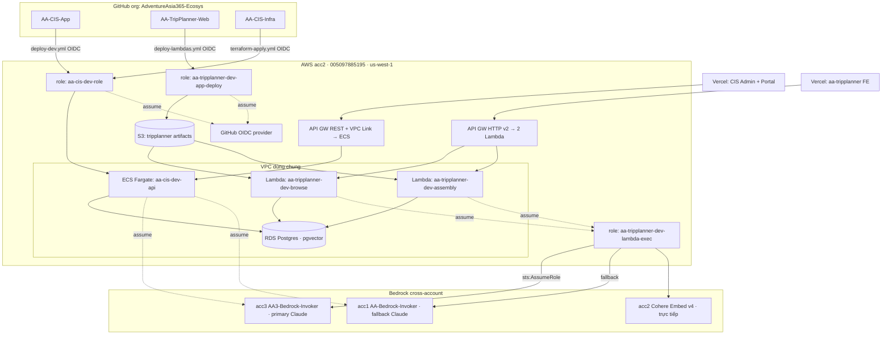

# AA-Ecosys — Kiến trúc hệ sinh thái (bản nháp)

> **Trạng thái:** nháp G0. Các mục đánh dấu **[FACT]** đã xác minh bằng đọc code/migration trong repo;
> **[CẦN XÁC NHẬN]** là suy luận/khoảng trống cần Nghiệp xác nhận. Không dùng làm nguồn sự thật vận hành
> cho tới khi review.

## 1. Tổng quan

AA-Ecosys là một **multi-repo**: mỗi app deploy độc lập, gom chung một thư mục local `~/projects/AA-Ecosys/`,
tất cả nằm dưới org GitHub `AdventureAsia365-Ecosys` (đổi tên từ `AdventureAsia365-CIS`).

| Thư mục local | Repo GitHub | Vai trò | Deploy |
|---------------|-------------|---------|--------|
| `apps/AA-CIS-App` | `AA-CIS-App` | FastAPI backend (CIS core + ACPv2 T-series) + Admin frontend + Tenant Portal | ECS Fargate (api) + Vercel (frontend) |
| `apps/AA-TripPlanner-Web` | `AA-TripPlanner-Web` | B2C web app: browse điểm đến + lập kế hoạch chuyến đi (Next.js FE + 2 Lambda BE) | Vercel (FE) + Lambda (BE) |
| `infra/AA-CIS-Infra` | `AA-CIS-Infra` | Terraform — VPC, RDS, ECS, Lambda, API GW, OIDC, Bedrock cross-account | GitHub Actions (aa365 root) + human/MFA (acc1/acc3 roots) |

**Nguyên tắc ranh giới [FACT]:** *App owns code, Infra owns resources.* Ví dụ rõ nhất là TripPlanner —
`infra/AA-CIS-Infra/accounts/aa365/tripplanner.tf` tạo 2 Lambda từ một zip placeholder 209 byte; repo
`AA-TripPlanner-Web` mới build code thật và đẩy qua `lambda:UpdateFunctionCode` (Terraform `ignore_changes`
phần code nên không ghi đè). Nguồn: `docs/implementation-notes/AA-TripPlanner-backend.md`.

## 2. Sơ đồ hệ thống

## 3. Phân vai schema database (RDS dùng chung, acc2)

Cả CIS và TripPlanner dùng **cùng một RDS Postgres** trong VPC acc2, nhưng **schema tách bạch hoàn toàn**.

### 3.1 CIS — mô hình medallion + multi-tenant RLS [FACT]

Nguồn: `infra/AA-CIS-Infra/modules/rds/migrations/003_schema_v3.sql`, `apps/AA-CIS-App/api/migrations/*`.

| Schema | Vai trò | Phạm vi |
|--------|---------|---------|
| `shared` | Bảng nền tảng: tenants, brand rules, seo config, api usage | Platform-wide |
| `silver_aa_internal` / `gold_aa_internal` | Medallion cho tenant nội bộ `aa_internal` (Master Content) | Platform (sentinel tenant) |
| `silver_{id}` / `gold_{id}` | Medallion tạo động mỗi khi thêm tenant mới | Per-tenant |
| `acp_contract` | Atom / Segment / Ranking / Route / Hub / Search Demand | Hỗn hợp (xem 3.2) |
| `acp_shared` | Subject (Slate) / Piece / Gate / Facts / tenant_config / marketplace | Hỗn hợp |
| `acp_deliver` | Trang giao cho tenant (`tenant_tour_pages`) | Per-tenant |

Cô lập tenant bằng **RLS** (`SET LOCAL app.tenant_id` mỗi transaction) và, nơi có nguy cơ trùng khoá,
bằng cách **gấp `tenant_id` vào chính identity** của row (vd `segment_id = sha256(tenant_id, place, action)`).

### 3.2 CIS — Master Content (platform-wide) vs Tenant Content [FACT]

Nguồn: `apps/AA-CIS-App/CONTEXT.md` (bảng Ownership AA-540).

- **Master Content (Admin, A-series):** tính **một lần, dùng chung** mọi tenant. Gồm A0 Upload → A3
  Master Content Pool (`gold_aa_internal.published_tours`) + **Atom** (`owner_scope='platform'`).
- **Tenant Content (T-series):** Segment / Score / Route / Hub / Slate / Subject / Piece — **per-tenant**.
  > **[CẦN XÁC NHẬN — tech debt]** Segment/Score/Route/Hub hiện per-tenant được `CONTEXT.md` đánh dấu là
  > **nợ kỹ thuật cần chuyển platform-wide** (ADR-0003), KHÔNG phải thiết kế cuối. Đừng xây feature mới
  > giả định per-tenant vĩnh viễn.

**3 cơ chế cross-tenant duy nhất (đã kiểm đếm) [FACT]:**
1. **Master Content pool + Atom pool** — nguồn dùng chung mọi tenant đọc trực tiếp (không phải cache).
2. **Search Demand + research log** — cache thật, khoá `(keyword, market)`/`(place, market)`, **không có cột `tenant_id`**.
3. **Facts Entry `scope='platform'`** — chia sẻ có chủ đích, cưỡng chế bằng RLS.

Ngoài ra 1 **cross-tenant read (không cache):** Gate cannibalization F10 so embedding Piece với mọi tenant khác.

### 3.3 TripPlanner — schema riêng biệt [FACT]

Nguồn: `apps/AA-TripPlanner-Web/migrations/001_tripplanner_schema.sql`.

- Schema `tripplanner` **độc lập hoàn toàn** với CIS, bật `pgvector`.
- Có phụ thuộc thứ tự migration `shared` với CIS (`002_shared_destinations.sql` phải áp trước vì FK) —
  **[CẦN XÁC NHẬN]** phối hợp đánh số migration `shared` giữa 2 app (nêu trong `docs/smoke-test-runbook.md`).

## 4. Data contracts

### 4.1 Frontend ⇄ Backend

| Cạnh | Contract | Nguồn |
|------|----------|-------|
| CIS FE (Vercel) ⇄ CIS API | REST qua API GW (REST + VPC Link) → ECS. Auth: JWT tenant + admin secret | `AA-CIS-App/.github/workflows`, CONTEXT.md |
| TripPlanner FE (Vercel) ⇄ BE | BFF Next.js gọi 2 URL Lambda qua API GW HTTP v2: `ANY /browse/{proxy+}` → browse, `ANY /trip/{proxy+}` → assembly. Env `BROWSE_API_URL`/`TRIP_API_URL` | `tripplanner.tf`, `docs/vercel-setup.md` |

### 4.2 Ranh giới app/infra (deploy contract) [FACT]

- **TripPlanner:** Infra tạo Lambda từ placeholder zip; App build + `UpdateFunctionCode`. Terraform
  `ignore_changes` code attrs. Bucket artifacts `aa-tripplanner-dev-lambda-artifacts-<acct>`.
- **CIS:** Infra tạo ECS/RDS/API GW; App build image → ECR → cập nhật ECS service.

### 4.3 Bedrock (cross-account) [FACT]

Nguồn: `docs/implementation-notes/AA-TripPlanner-backend.md`, `accounts/acc1-bedrock`, `accounts/acc3-bedrock`.

- **Embeddings (Cohere Embed v4):** acc2 gọi trực tiếp `bedrock:InvokeModel`, không satellite.
- **Claude:** acc2 KHÔNG gọi trực tiếp được → `sts:AssumeRole` sang **acc3 (primary)** / **acc1 (fallback)**.
  - acc3 role `AA3-Bedrock-Invoker`, ExternalId `aa296-satellite-bedrock-acc3`.
  - acc1 role `AA-Bedrock-Invoker`, ExternalId `aa296-satellite-bedrock`.
- Trust cross-account tham chiếu **role ARN** `aa-tripplanner-dev-lambda-exec` (KHÔNG dính tên GitHub) →
  đổi tên org không ảnh hưởng các trust này.

## 5. OIDC / CI-CD (điểm rủi ro #1 của restructure)

| Role | File | sub hiện tại | Repo dùng |
|------|------|--------------|-----------|
| `aa-cis-dev-role` | `accounts/aa365/cicd.tf` | `repo:AdventureAsia365-CIS/*:*` (org-wide, phẳng) | AA-CIS-App, AA-CIS-Infra |
| `aa-tripplanner-dev-app-deploy` | `accounts/aa365/tripplanner.tf` | `repo:AdventureAsia365-CIS*/AA-TripPlanner-Web*:*` (có `*` do "include repo ID in subject") | AA-TripPlanner-Web |

**Nguyên tắc đổi tên an toàn:** mở rộng trust để chấp nhận **cả** org cũ **và** org mới (additive) **TRƯỚC**,
đổi tên org **SAU**, gỡ trust cũ ở bước cuối. Role ARN trong workflow lấy từ `secrets`/`vars`, tên tài
nguyên dùng prefix `aa-cis-*`/`aa-tripplanner-*` (độc lập tên GitHub) → chỉ phần khớp `sub` chịu ảnh hưởng.

> **[FACT — xác minh 15/09/2026]** OIDC subject customization KHÔNG bật ở cấp org (Subject claim
> template trống, immutable subject claim tắt). Dạng `@<id>` chỉ do repo `AA-TripPlanner-Web` tự bật
> (repo-level). Vì vậy `cicd.tf` giữ pattern phẳng `repo:<org>/*:*` là đúng; ở G5 bỏ biến thể wildcard dư.

## 6. Nợ / mở rộng tương lai

- **AA-Booking (AAA):** sản phẩm B2C mới, sẽ thêm repo `AA-Booking` sau. Điểm bàn giao TripPlanner → AAA:
  xem `docs/tripplanner-to-aaa-handoff.md`.
- **[CẦN XÁC NHẬN]** CloudFront trước các route browse của TripPlanner (nêu là "later change").

## 7. Nguồn tham chiếu

- `apps/AA-CIS-App/CONTEXT.md` — glossary + bảng Ownership/cross-tenant (AA-540).
- `infra/AA-CIS-Infra/docs/implementation-notes/AA-TripPlanner-backend.md` — báo cáo Terraform TripPlanner.
- `infra/AA-CIS-Infra/accounts/aa365/{cicd.tf, tripplanner.tf}` — OIDC roles.
- `apps/AA-TripPlanner-Web/docs/{vercel-setup,architecture-overview,smoke-test-runbook}.md`.
- `docs/inventory-old-refs.md` — kiểm kê tham chiếu tên cũ.
