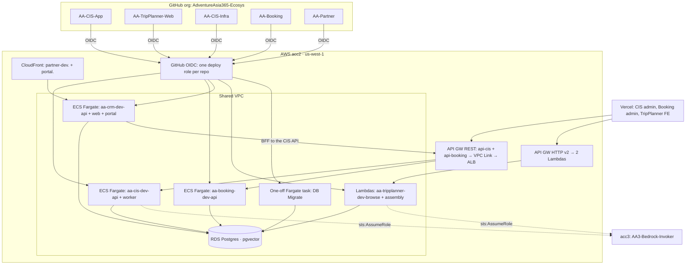

# AA-Ecosys — Ecosystem architecture

> **Status:** reviewed 2026-10-28 (S255) against code, migrations and Terraform on `main`: acc1 left the ecosystem
> (AA-998), the Content studio runs on Fargate (AA-979 P2b), the TripPlanner place tables are dropped (tp-018), and
> the newest migrations are CIS 294, tp-020, bk-032 and crm-023. Earlier revisions: 2026-10-18 (S242, Cognito
> WORKFORCE for CIS staff), 2026-10-16 (S239, AA-Booking refresh), 2026-10-14 (S235–S236), 2026-10-11 (S225),
> 2026-09-25. Items marked **[FACT]** were checked in code, migrations or live state; **[TO CONFIRM]** marks an
> inference or gap the tech lead still has to confirm.
> Target direction and decisions: [ADR 0001](adr/0001-ecosystem-target-architecture.md),
> [ADR 0002](adr/0002-only-cis-writes-content.md), [ADR 0003](adr/0003-one-durable-job-model.md),
> [ADR 0004](adr/0004-aa-booking-stack-and-bootstrap.md) (AA-Booking stack and bootstrap) with
> [amendment A1](adr/0004a-supply-content-ownership.md) (supply content ownership),
> [ADR 0005](adr/0005-pricing-and-supplier-rates.md) (pricing and supplier rates),
> [ADR 0006](adr/0006-ecosystem-identity.md) (ecosystem identity on Cognito) with
> [amendment A](adr/0006a-identity-phase1-amendments.md) (Phase 1 as shipped),
> [ADR 0007](adr/0007-place-pipeline-in-cis.md) (place pipeline in CIS: `geo` schema, `catalog.*` views),
> [ADR 0010](adr/0010-aa-partner-app.md) (AA-Partner app). Contract rules between apps:
> [`contracts/README.md`](contracts/README.md).

## 1. Overview

AA-Ecosys is a **multi-repo**. Each app deploys on its own. Locally the repos sit under one folder,
`~/projects/AA-Ecosys/`, and all of them live in the GitHub org `AdventureAsia365-Ecosys` (renamed from
`AdventureAsia365-CIS`).

| Local folder | GitHub repo | Role | Deploy |
|---|---|---|---|
| `apps/AA-CIS-App` | `AA-CIS-App` | Content system of record: FastAPI backend (CIS core, A-series, T-series, the Content studio API `/v1/*`), durable job worker, admin frontend. The tenant portal UI moved to AA-Partner (AA-979 P2a); the `portal/` folder here is a frozen, undeployed copy until the P2b clean-up | ECS Fargate (`aa-cis-dev-api` + `aa-cis-dev-worker`, one image) + Vercel `aa-cis-frontend` (admin) |
| `apps/AA-TripPlanner-Web` | `AA-TripPlanner-Web` | B2C web app: browse destinations, plan a trip, sign in and keep trips (Next.js FE + 2 Lambda BE) | Vercel `aa-tripplanner` (FE) + Lambda (BE) |
| `infra/AA-CIS-Infra` | `AA-CIS-Infra` | Terraform: VPC, RDS, ECS, Lambda, API GW, CloudFront, Cognito, OIDC, alarms, the acc3 Bedrock satellite; DB Migrate and DB Schema Dump workflows | GitHub Actions (`accounts/aa365` root) + a human with MFA (`accounts/acc3-bedrock` root) |
| `apps/AA-Booking` | `AA-Booking` | AAA: advisor workflow and booking lifecycle. Live on Dev since 2026-10-14: inquiry intake, staff trip cases and proposals, pricing and FX, suppliers and supply, sellable trip plans, operations (supplier bookings, invoices, payments, supplier bills), the B2B API for AA-Partner; staff admin frontend (see 3.4) | ECS Fargate `aa-booking-dev-api` on the CIS cluster `aa-cis-dev-cluster` (acc2, same VPC, ADR 0004) + Vercel `aa-booking-admin` |
| `apps/AA-Partner` (public) | `AA-Partner` | Partner agencies' app (ADR 0010, accepted 2026-10-22): the agency CRM and the tenant Content studio (`portal/`, moved from AA-CIS-App with its history by AA-979 P2a). Own schema `crm` (`crm-001` to `crm-023`), own LLM gateway, partner Cognito pool with MFA (ADR 0006b). Integrations are bring-your-own (agency Twilio/WhatsApp, Stripe, mailbox, e-sign); AA provides the maps. The API runs the `crm.job` worker in its own process | ECS Fargate ARM64 on `aa-cis-dev-cluster`: `aa-crm-dev-api`, `aa-crm-dev-web` (CRM, behind CloudFront `partner-dev.` → VPC origin → NLB → ALB `/crm/*`) and `aa-crm-dev-portal` (Content studio, behind its own CloudFront distribution for `portal.`, live since the P2b cutover). Images in IMMUTABLE ECR repos tagged with the git SHA; deploy by the GitHub OIDC role `aa-crm-dev-app-deploy`. The Vercel project `aa-cis-portal` is the rollback target until 2026-11-03 |

**Boundary rule [FACT]:** *apps own code, Infra owns resources.* TripPlanner shows it best:
`infra/AA-CIS-Infra/accounts/aa365/tripplanner.tf` creates the 2 Lambdas from a 209-byte placeholder zip.
The `AA-TripPlanner-Web` repo builds the real code and ships it with `lambda:UpdateFunctionCode`.
Terraform `ignore_changes` covers the code attributes, so it never overwrites them. Source:
`infra/AA-CIS-Infra/docs/implementation-notes/AA-TripPlanner-backend.md`.

**AWS accounts [FACT]:** acc2 (us-west-1) holds all infrastructure. acc3 hosts only the Bedrock invoker role, the
Bedrock Batch service role and the Cost Explorer reader. acc1 (a personal account) was removed from the ecosystem on
2026-10-28 (AA-998, [ADR 0001a](adr/0001a-retire-acc1-llm-on-acc3-only.md)). Account IDs and profiles: the account
map in [onboarding](onboarding.md).

## 2. System diagram

The deployment view with the official AWS Architecture Icons (AA-697). The same folder holds one view per repo:
[AA-CIS-Infra](architecture/diagrams/infra.svg), [AA-CIS-App](architecture/diagrams/cis.svg),
[AA-Booking](architecture/diagrams/booking.svg), [AA-TripPlanner-Web](architecture/diagrams/tripplanner.svg) and
[AA-Partner](architecture/diagrams/partner.svg); sources, conventions and how to re-render them:
[architecture diagrams](architecture/diagrams/README.md).

The same view as a Mermaid flowchart (text, for readers that show no images):

```mermaid
flowchart TB
  subgraph GH[GitHub org: AdventureAsia365-Ecosys]
    R1[AA-CIS-App]
    R2[AA-TripPlanner-Web]
    R3[AA-CIS-Infra]
    R4[AA-Booking]
    R5[AA-Partner]
  end

  subgraph acc2[AWS acc2 · us-west-1]
    subgraph vpc[Shared VPC]
      ECS[ECS Fargate: aa-cis-dev-api + worker]
      BK[ECS Fargate: aa-booking-dev-api]
      CRM[ECS Fargate: aa-crm-dev-api + web + portal]
      RDS[(RDS Postgres · pgvector)]
      L12[Lambdas: aa-tripplanner-dev-browse + assembly]
      MIG[One-off Fargate task: DB Migrate]
    end
    APIG[API GW REST: api-cis + api-booking → VPC Link → ALB]
    APIG2[API GW HTTP v2 → 2 Lambdas]
    CF[CloudFront: partner-dev. + portal.]
    OIDC[GitHub OIDC: one deploy role per repo]
  end

  VERCEL[Vercel: CIS admin, Booking admin, TripPlanner FE]
  ACC3[acc3: AA3-Bedrock-Invoker]

  R1 & R2 & R3 & R4 & R5 -->|OIDC| OIDC
  OIDC --> ECS & BK & CRM & L12 & MIG
  ECS & BK & CRM & MIG & L12 --> RDS
  ECS & L12 -.sts:AssumeRole.-> ACC3
  APIG --> ECS & BK
  APIG2 --> L12
  CF --> CRM
  VERCEL --> APIG & APIG2
  CRM -->|BFF to the CIS API| APIG
```

Embeddings (Cohere Embed v4) are called on acc2 directly, without the satellite (4.3).

## 3. Database schema roles (shared RDS, acc2)

CIS, TripPlanner, AA-Booking and AA-Partner (CRM) use **one RDS Postgres** in the acc2 VPC, with **fully separate
schemas**. Each schema has exactly one owner repo, and only that repo writes migrations for it. See
[`database/schema-ownership.md`](database/schema-ownership.md) for the owners, the `shared.*` table owners and the
version keys `NNN` / `tp-NNN` / `bk-NNN` / `crm-NNN` / `rl-NNN`. Migrations reach Dev through the **DB Migrate**
workflow of AA-CIS-Infra (an identical copy in `db/migrations/<owner>/`, check → apply), never from a laptop.
Column-level truth: [`architecture/db-schema-reference.md`](architecture/db-schema-reference.md).

### 3.1 CIS — medallion + multi-tenant RLS [FACT]

Source: `apps/AA-CIS-App/api/migrations/*`.

| Schema | Role | Scope |
|---|---|---|
| `shared` | Platform tables: tenants, brand rules, SEO config, API usage, jobs (`shared.job`), LLM gateway + cost logs, destinations, photos, countries | Platform-wide |
| `silver_aa_internal` / `gold_aa_internal` | Medallion for the internal tenant `aa_internal` (Master Content) | Platform (sentinel tenant) |
| `acp_contract` | Atom / Segment / Ranking / Route / Hub / Search Demand | Mixed (see 3.2) |
| `acp_shared` | Subject (Slate) / Piece / Gate / Facts / tenant_config / publish log | Mixed |
| `acp_deliver` | Pages delivered to tenants (`tenant_tour_pages`) | Per tenant |
| `geo` | Place pipeline: tour builds, itinerary components, place names, tour graph (ADR 0007) | Platform |
| `catalog` | Read-only contract views for other apps (`catalog.tour.v1`, `catalog.graph.v1`) | Platform |
| `retired` | Quarantine of dead tables before their drop (CIS 294, AA-850) | Platform |

No per-tenant schema exists: the `silver_<id>` / `gold_<id>` plan of migration 003 is not used. Tenants are isolated
with **RLS** (`SET LOCAL app.tenant_id` per transaction). Where keys could collide, `tenant_id` is **folded into the
row identity** (for example `segment_id = sha256(tenant_id, place, action)`).

### 3.2 CIS — Master Content (platform-wide) vs Tenant Content [FACT]

Source: `apps/AA-CIS-App/CONTEXT.md` (ownership table, AA-540).

- **Master Content (admin, A-series):** computed **once, shared** by every tenant. A0 Upload → A3
  Master Content Pool (`gold_aa_internal.published_tours`) + **Atoms** (`owner_scope='platform'`). Atom
  reads go through `acp_contract.v_active_tour_atoms`, which follows the Master status (AA-713).
- **Platform-wide derived data:** **Segment / Score / Route / Hub**, platform-wide since AA-545
  (migration 146, 2026-09-06), with no `tenant_id` column. Score = rank-sum over 4 dimensions (Demand /
  Recurrence / Questions / Said, AA-610), one pass per buyer market.
- **Tenant Content (T-series):** from **Slate** onward (Slate / Subject / Goal / Angle / Piece /
  Publish), **per tenant**. Slate has a **Debate** layer (AA-631: contested + brand-fit, advisory, never
  cuts more than 50%).

**Shared across tenants [FACT]:**

1. **Master Content pool + Atom pool:** a shared source every tenant reads directly (not a cache).
2. **Segment / Score / Route / Hub:** platform-wide rows.
3. **Search Demand + research log:** a real cache keyed `(keyword, market)` / `(place, market)`, with **no
   `tenant_id` column**. It stores `serp_domains` since AA-631.
4. **Facts Entry `scope='platform'`:** deliberate sharing, enforced by RLS.

Plus one **cross-tenant read (not a cache):** Gate F10 (cannibalization) compares a Piece's embedding
with every other tenant's.

### 3.3 TripPlanner — separate schema [FACT]

Source: `apps/AA-TripPlanner-Web/migrations/*`.

- Schema `tripplanner` (owner role `tp_owner` since tp-013) is **fully independent** of CIS. It holds the trip user
  state: `sessions`, `customers`, `trip_drafts`, `trip_events`, `outbox`, `narration_cache`, `llm_spend_daily`,
  `component_id_map` and `traveller_accounts` (tp-019, AA-908). Its migrations register `tp-NNN` in
  `shared.schema_versions` (from tp-007).
- TripPlanner reads CIS only through `catalog.*` views: tours, days, places, photos, destinations, the place graph
  and vector search (`catalog.v_component_embedding`, CIS 253). Its direct grants on CIS tables (`raw_tours`,
  `tour_atoms`, `published_tours`, `shared.destinations`, the `shared` photo views) were revoked by CIS 254 and
  CIS 270 (AA-712). The one standing write exception is INSERT on `shared.llm_call_log`.
- **Place read models (ADR 0007):** the frozen pilot tables (`itinerary_components`, `tour_day`, `tour_stop`,
  `tour_graph_*`, `tour_leg`, `tour_junction`) were dropped by tp-018 on 2026-10-23. CIS builds places in its own
  schema `geo` and serves them through `catalog.*` views.
- TripPlanner publishes views to other apps: `v_inquiry_outbox` to Booking (tp-009) and the ops views to `cis_app`
  (`v_ops_traffic_daily` tp-015; `v_ops_data_totals`, `v_ops_pin_components`, `v_ops_component_id_map` tp-020).

### 3.4 AA-Booking — schema `booking` [FACT]

Decided 2026-09-28 (ADR 0001 decisions 6–7): AA-Booking runs on acc2 and shares the RDS with its own
schema `booking` (version key `bk-NNN`). AA-CIS-Infra provisions it inside acc2 (ECS service, ECR, DB
role, API route); there are no new accounts. It never writes another app's schema. Contracts are
versioned JSON in `docs/contracts/` (rules: [`contracts/README.md`](contracts/README.md)):

- **`inquiry.submitted`** (TripPlanner → AA-Booking, with the multi-tour leg chain; files
  `docs/contracts/inquiry.submitted.v1*.json`) is carried by a **transactional outbox**. TripPlanner's
  `tripplanner.v_inquiry_outbox` (grant `tp-009`) is pulled by Booking's `booking.job` worker into
  `booking.inbox_events` with an idempotency key. Booking then creates the lead customer, the trip case and the staff
  notification.
- **CIS catalog** (contract `catalog.tour.v1`, CIS migration 225 grant to role `booking`) is **read live at request
  time, never copied** (S237 decision D4, AA-679). Booking reads `catalog.v_tour` / `v_tour_day` / `v_tour_photo` for
  sellable trip plans and keeps only the commercial rows keyed on the CIS `source_id`. It reads
  `catalog.v_destination` and `catalog.v_country` for places and countries, and `catalog.v_supply_content` for the
  AA-written supply content (CIS 278).
- **Supply feed** (Booking → CIS, contracts `supply.hotel.v1` / `supply.service.v1`, bk-023): CIS pulls
  `booking.v_supply_outbox` and keeps the AA-written content per Booking entity.
- **B2B API** (`booking.b2b.v1`, `/booking/b2b/v1`) serves AA-Partner over HTTP with Cognito M2M tokens.

Identity: ADR 0001 decision 6 gave AA-Booking the customer identity (its own OTP stack, tables in `bk-001`).
[ADR 0006](adr/0006-ecosystem-identity.md) amends this: the target is the shared Cognito EXTERNAL pool
for travellers and Booking customers (AA-680), so the `bk-001` OTP tables are interim and not built out.
`bk-024` links a signed-in traveller's `(iss, sub)` to a customer. Staff sign-in: see 4.6.
Stack, runtime and decisions O1–O9: [ADR 0004](adr/0004-aa-booking-stack-and-bootstrap.md) (Accepted
2026-10-14); prices and suppliers: [ADR 0005](adr/0005-pricing-and-supplier-rates.md).

Live on Dev since 2026-10-14 (AA-678, `infra/AA-CIS-Infra/accounts/aa365/booking.tf`):

| Item | Value |
|---|---|
| Repo | `AdventureAsia365-Ecosys/AA-Booking` |
| Runtime | ECS service `aa-booking-dev-api` on `aa-cis-dev-cluster`, own ECR `aa-booking-dev-api`, log group `/ecs/aa-booking-dev`, own execution and task roles |
| Entry | Separate REST API `aa-booking-dev-api` on the **shared VPC link** → NLB → ALB listener rule `/booking`, `/booking/*` → Booking target group. Custom sub-domain `api-booking.lumiguides.it.com` (ADR 0004 O2) |
| Database | Schema `booking`, owner role `bk_owner` (since bk-014), login role `booking` (DSN in Secrets Manager `booking/dev/database-url`). Migrations applied through Infra DB Migrate from `bk-001` (2026-10-14) to `bk-032` (2026-10-28) |
| Slices | `bk-001` foundation (customers, OTP tables, audit log, inbox events) · `bk-002` inquiry intake + `booking.job` worker (AA-681) · `bk-003` staff profiles, trip case workflow, proposal versions · `bk-004` / `bk-006` / `bk-007` pricing engine, rules + FX with maker-checker (AA-810, ADR 0005) · `bk-008` suppliers + contracts (AA-822) · `bk-009` sellable trip plans over the live catalog (AA-679) · `bk-010` hotels, room types, services, supplier net rates (AA-823) · `bk-011` catalog tour key on trip case legs (AA-830) · `bk-020` to `bk-022` departures and holds, B2B commercial rules, B2B event feed · `bk-023` supply outbox and media (AA-835) · `bk-024` customer identities (AA-908) · `bk-026` to `bk-028`, `bk-030` operations MVP: supplier bookings, trip checks, invoices and payments, supplier bills and payouts (AA-682) · `bk-029`, `bk-031` Booking state of CIS countries and destinations, `bk-032` trip plan supplier and price matrix (AA-996). Staff "new inquiry" e-mail through SES (`bk_notify_email` job, AA-811). Staff admin frontend in `frontend/` (Next.js, Vercel `aa-booking-admin`, AA-683) |
| Health | `/booking/health` (liveness, reports `git_sha`), `/booking/health/ready` (DB + every required `bk-NNN`) |

## 4. Data contracts

### 4.0 Write rule — only CIS writes content (ADR 0002, 2026-10-01) [FACT]

- **Content** (tours, atoms, places in `shared.destinations`, itinerary places and tour graph, photos) is
  created, changed and deleted **only by CIS**, through a job or an admin action with a tracking page.
- Other apps (TripPlanner, AA-Booking, AA-Partner) **read through views or HTTP contracts only** and write only their
  own schema. The one standing write exception is INSERT on `shared.llm_call_log` for TripPlanner. DB grants enforce
  it: since CIS 270 the role `tripplanner` has no grant on a CIS table and reads `catalog.*` views.
- The place pipeline (itinerary extraction, geocode, tour graph) runs in CIS (AA-712,
  [ADR 0007](adr/0007-place-pipeline-in-cis.md)): CIS-owned schema `geo`, job kinds `place_extract` /
  `place_geocode` / `tour_graph_build` on `shared.job`, `shared.destinations` unique on
  `(name_norm, country, locality_norm)`, and Geoapify (OSM data, storable) as the confirming geocoder for all
  countries, with Mapbox as basemap only. TripPlanner reads the `catalog.*` place and graph views.

### 4.0a Tour liveness and retirement (ADR 0015, Accepted, AA-986)

- Whether an AA tour is **served** is one CIS-owned state per catalog key `(source_system, source_id)`:
  `served` / `retired` / `paused` / `restored`. It is derived from `raw_tours` and `published_tours` status columns,
  changed only by one CIS write service, and read inside CIS from one view.
- Other apps learn about a retirement from a CIS-owned change record, read through the tombstone and outbox contract
  views `catalog.v_tour_retired` and `catalog.v_tour_lifecycle_outbox` (CIS 274, contract `catalog.tour.v1.3`,
  additive). They do not infer it from a tour missing in `catalog.v_tour`. A `paused` key is a temporary absence
  (404, not 410).
- Per app: tenants keep their T2 copies and posts with a warning, and new work is refused (409 `tour_discontinued`).
  Booking keeps confirmed bookings with a staff flag and refuses new quotes and holds. TripPlanner answers 410 and
  flags saved trips. SEO answers 410 for retired and 301 for superseded. A supersede is not a deletion.
- Rule and open questions: [ADR 0015](adr/0015-tour-liveness-and-retirement-propagation.md); evidence:
  [S248 audit memo](audits/2026-10-23-S248-tour-deletion-propagation/memo.md).

### 4.1 Frontend ⇄ backend

| Edge | Contract | Source |
|---|---|---|
| CIS FE (Vercel) ⇄ CIS API | REST through API GW (REST + VPC Link) → ALB → ECS. Auth: tenant JWT; staff = Cognito WORKFORCE access token as `Authorization: Bearer` (legacy HS256 sessions refused since AA-816 S2, `LEGACY_ADMIN_LOGIN_ENABLED` off by default), plus the admin secret added by the BFF for paths outside the staff prefixes (4.6) | `AA-CIS-App/CONTEXT.md` |
| Content studio (`aa-crm-dev-portal`) ⇄ CIS API | The portal BFF calls the CIS API. A partner-pool access token is exchanged at `POST /auth/tenant-session` for a 15-minute tenant JWT ([ADR 0010a](adr/0010a-content-studio-partner-sign-in.md)) | `AA-Partner/CONTEXT.md` |
| AA-Booking ⇄ clients | REST through API GW `aa-booking-dev-api` (shared VPC Link) → ALB `/booking/*` → ECS `aa-booking-dev-api`. The staff admin frontend calls it through its Next.js BFF. Staff auth: see 4.6 | `booking.tf`, ADR 0004 |
| TripPlanner FE (Vercel) ⇄ BE | The Next.js BFF calls 2 Lambda URLs through API GW HTTP v2: `ANY /browse/{proxy+}` → browse, `ANY /trip/{proxy+}` → assembly; header `X-TripPlanner-Key`. Env `BROWSE_API_URL` / `TRIP_API_URL` | `tripplanner.tf`, `docs/vercel-setup.md` |

Contracts between apps (views, grants, events) are listed in each repo's `CONTEXT.md`
("Contracts with other apps").

### 4.2 App / infra boundary (deploy contract) [FACT]

- **TripPlanner:** Infra creates the Lambdas from a placeholder zip; the app builds and calls
  `UpdateFunctionCode`. Terraform `ignore_changes` covers the code attributes. Artifacts bucket
  `aa-tripplanner-dev-lambda-artifacts-<acct>`.
- **CIS:** Infra creates ECS / RDS / API GW; the app builds an image → ECR → new task definitions for api
  and worker on the same image (`Deploy Dev`). The deploy is blocked only while a rerun wave is open or a
  deploy-blocking job kind runs or is due; other jobs are drained and re-claimed (C6.3a, AA-993 G5).
- **AA-Booking:** Infra creates ECR / ECS service / roles / REST API (`booking.tf`, task definition and
  desired count in `ignore_changes`). The app builds an image tagged with the git SHA, deploys through
  its own least-privilege role `aa-booking-dev-app-deploy`, then smoke-tests `/booking/health` (same `git_sha`) and
  `/booking/health/ready`. Booking has its own `booking.job` table (`bk-002`, ADR 0004 O3). The `preflight` job of
  Booking `deploy-dev.yml` calls `GET /booking/ops/deploy-gate` with its GitHub OIDC token. Since AA-993 G5 it waits
  only while a retention job (the deploy-blocking kinds) runs or is due within 15 minutes (C6.3a).
- **AA-Partner:** Infra creates ECR / ECS services / roles / CloudFront (`crm_app.tf`, `crm_web.tf`, `crm_portal.tf`,
  `crm_agency_edge.tf`). The app deploys through its role `aa-crm-dev-app-deploy`.
- **Migrations:** the owner repo authors them; Infra's DB Migrate applies them to Dev before the app code
  that needs them merges. DB Migrate `apply` still waits until every job table is idle.

### 4.3 Bedrock [FACT]

Source: `infra/AA-CIS-Infra/accounts/aa365/bedrock_satellite_assume.tf`, `accounts/acc3-bedrock`,
[ADR 0001a](adr/0001a-retire-acc1-llm-on-acc3-only.md).

- **Embeddings (Cohere Embed v4):** acc2 calls `bedrock:InvokeModel` directly, with no satellite.
- **Claude and other chat models:** acc2 cannot call them directly, so it runs `sts:AssumeRole` into **acc3**,
  role `AA3-Bedrock-Invoker`, ExternalId `aa296-satellite-bedrock-acc3`. acc3 is the only LLM account and there
  is no cross-account fallback: when an acc3 call fails, the stage route falls back to another model on acc3, or the
  job retries.
- Cross-account trust references the **role ARNs** (`aa-tripplanner-dev-lambda-exec`, the ECS task role), never
  GitHub names, so the org rename did not affect them.
- The satellite role trusts only the **ECS task role** and the TripPlanner Lambda exec role. Claude therefore
  cannot be called from a laptop; real measurements and A/B runs go through ECS exec in the `api` container.
- **The model per stage is decided by the DB (Model Gateway):** `shared.llm_role_config` +
  `shared.llm_model_catalog`, editable in CIS admin Settings → LLM Models (shadow switch and sample %).
  Every call is logged to `shared.llm_call_log`. Do not memorize the current routing; read the Settings
  page. Policy (S222): every LLM path prefers Bedrock; judges default to GPT Luna via Bedrock acc3, with OpenAI
  kept as a fallback; one judge model is picked by 2026-10-31.
- **Bedrock Batch (AA-606):** the S3 prefix `batch-*/s1-rewrite/*` and the acc3 batch service role exist, but AWS
  **has not enabled Batch Inference for acc3** (blocker AA-624), so no real batch job has run yet.
  **[TO CONFIRM]** current status of the AWS support case.

### 4.4 Cost monitoring (cross-account) [FACT]

Source: epic AA-616 (AA-617/618/619/620/622/623/625/627/635), `infra/AA-CIS-Infra/CONTEXT.md`.

- **Token-based estimate:** `shared.llm_call_log` (account, provider, fallback; rows before AA-998 can name acc1) +
  `shared.dfs_call_log` (real DataForSEO cost, cache hits). DFS cache TTL 7 days. Ad-hoc scripts must log
  too (`stage="adhoc_<issue>"`).
- **Real AWS bills:** acc2 is a **member account**, not the AWS Organizations payer, so there is no consolidated Cost
  Explorer call. acc2 calls Cost Explorer directly for its own costs and assumes `AA3-CostExplorer-Reader` for acc3.
  Snapshots live in `shared.cost_explorer_snapshot`, refreshed by `POST /admin/cost-explorer/check`.
- **Admin page "External Spend"** (`/admin/llm-usage`): estimate vs real bill, Bedrock split from
  infrastructure per account, date-range filter.
- **DFS balance alert:** Lambda `aa-cis-dev-dfs-balance-check` + a daily EventBridge Scheduler (group
  `aa-cis-dev-acp`); the same probe also calls `/admin/waves/check` (AA-727).
- **Log-write failure alarms (AA-756):** CloudWatch metric filters + alarms on `/ecs/aa-cis-dev` for
  `llm_call_log` / `decision_log` / `llm_shadow_log` / `dfs_call_log` write failures (namespace
  `aa-cis/ops`). Full list: [alarm catalog](generated/alarms.md).

### 4.5 AA photos (AA-708, 2026-10-01) [FACT]

One photo source for the whole ecosystem, per ADR 0001 decision 1 (CIS is the content source, other apps
read a read model):

| Part | Owner | Notes |
|---|---|---|
| Originals | Content team | PHOTOS folder on Jira CON (Google Drive, public link) |
| Sync + match | CIS — job `photo_sync`, page Admin › Photos | Drive → S3 (WebP 1600/600) → `shared.place_photo` |
| Reading photos | Every app | **Views only.** Other apps read `catalog.v_tour_photo` (per tour) and `catalog.v_destination_photo` (per place); CIS reads its `shared` photo views. Never the tables |
| Photo URL | CIS public API | `{CIS_API_BASE}{path}?size=large\|small` (302 → S3; later CloudFront, same path) |
| TripPlanner destination cover | CIS writes `shared.destinations.cover_image_url` | Only empty cells, or cells this job set earlier |

Order per country (rerun wave): S1 rewrite → A3 atomize → place extraction (the CIS `place_extract` job, enqueued by
atomize, writes `geo.*`; the graph build enqueues the cover and photo match) → Admin › Photos: "Sync <country>" +
"Match places + covers". A photo is matched only against places in **that tour's own itinerary**.

### 4.6 Identity (ADR 0006 + 0006a + 0006b) [FACT]

One identity service for the ecosystem: Amazon Cognito in acc2, Essentials plan, Terraform in AA-CIS-Infra
`accounts/aa365/identity*.tf`. Pool IDs: Terraform outputs, not prose.

| Population | Pool / client | State |
|---|---|---|
| CIS staff | WORKFORCE, client `cis-admin` | **Live.** Email one-time code on managed login at `https://staff-auth.lumiguides.it.com` (AA-branded). The CIS BFF runs auth code + PKCE. The CIS API verifies the access token (WORKFORCE issuer only, `client_id` ∈ {cis-admin, breakglass}, `token_use=access`) and resolves the `shared.admin_users` row by `(iss, sub)`; role = highest `cis-*` group. Legacy password login off since AA-816 S2 (2026-10-22; `LEGACY_ADMIN_LOGIN_ENABLED` off by default, ADR 0006a A12). Preview signs in on `aa-cis-preview.lumiguides.it.com` with client `cis-admin-preview`, capped at viewer (A11) |
| Break-glass | WORKFORCE, client `breakglass` | **Live, disabled at rest.** `admin@adventure.asia`, password + TOTP. Secret `aa-identity/dev/breakglass` is readable only by the MFA admin role; every read, write and token issue alerts |
| Booking staff | WORKFORCE, clients `booking-staff`, `booking-staff-preview` | **Phase 2, in transition.** The Booking API verifies WORKFORCE access tokens (roles from `cognito:groups`, mirrored from CIS `shared.staff_app_grant`). It still accepts the CIS bridge token (ADR 0004 O1, `aud=booking`) until AA-680 removes it (ADR 0006a A6) |
| Content studio users | PARTNER pool (ADR 0006b, MFA) | **Live since the AA-979 P2b cutover.** People re-enrol through a CIS-created, CRM-delivered invitation; CIS exchanges the partner access token for a 15-minute tenant JWT ([ADR 0010a](adr/0010a-content-studio-partner-sign-in.md)). API keys stay for machines |
| Agency CRM users | PARTNER pool, AA-Partner web | **Live.** Membership in `crm.member` by `(iss, sub)`, then the CRM permission matrix |
| Travellers | EXTERNAL, client `tripplanner` | **Built (AA-908, tp-019).** E-mail code sign-in and My Trips; the guest trip is claimed into `tripplanner.traveller_accounts` at first sign-in |
| Booking customers | EXTERNAL, client `booking-customer` | Phase 4 (AA-680). No customer-facing Booking app yet |

- **Staff directory = CIS.** `shared.admin_users` (+ `email`, `cognito_iss`/`cognito_sub`, `is_owner`, CIS 247)
  and `shared.staff_app_grant` (per-app roles) are the source of truth. Only owners write it, from the CIS admin
  Staff page. Each write goes to the DB first, then to Cognito through the CIS task role's allow-list.
  A report-only job `staff_directory_reconcile` compares the two.
- Apex `lumiguides.it.com` is an A record to Vercel (the `aa-cis-frontend` project redirects it to
  `aa-cis.lumiguides.it.com`); Cognito requires a parent A record for its custom domains.

## 5. OIDC / CI-CD

Every CI job assumes its **own** role through GitHub OIDC (AA-806 role split, `cicd_split.tf`). The
legacy shared `aa-cis-dev-role` was retired in AA-806 step 3 (S239), and the apply boundary denies recreating it.
The repos use GitHub's immutable subject claim, so every trust pins the org id and the repo id
(`repo:AdventureAsia365-Ecosys@<org_id>/<repo>@<repo_id>:<context>`). The exact values live in Terraform
(`local.oidc_sub_cis_app`, `local.oidc_sub_cis_infra`, `local.tp_oidc_subjects`, `local.bk_oidc_subjects`,
`local.crm_oidc_subjects`, `local.docs_sync_oidc_sub`), not in prose. Checked against AA-CIS-Infra `main` on
2026-10-28.

| Role | File | Trusted context | Used by |
|---|---|---|---|
| `aa-cis-dev-app-deploy` | `accounts/aa365/cicd_split.tf` | AA-CIS-App, `environment:dev` | CIS `Deploy Dev` (ECR push, CIS task families and services only) |
| `aa-cis-infra-tf-plan` | `accounts/aa365/cicd_split.tf` | AA-CIS-Infra, `pull_request` | `Terraform Plan` (read only) |
| `aa-cis-infra-tf-apply` | `accounts/aa365/cicd_split.tf` | AA-CIS-Infra, `environment:prod` | `Terraform Apply Prod`, `DB Migrate`, `DB Schema Dump`, `DB Isolation Probe` (boundary `aa-cis-infra-tf-apply-boundary`) |
| `aa-booking-dev-app-deploy` | `accounts/aa365/booking.tf` | AA-Booking, `environment:dev` or `ref:refs/heads/main` | Booking `Deploy Dev` (Booking ECR, task family and service only) |
| `aa-tripplanner-dev-app-deploy` | `accounts/aa365/tripplanner.tf` | AA-TripPlanner-Web, `ref:refs/heads/main` | `deploy-lambdas.yml` (artifact zip + the two Lambdas' code) |
| `aa-crm-dev-app-deploy` | `accounts/aa365/crm_app.tf` | AA-Partner, `environment:dev` | AA-Partner deploy workflows (CRM api, web and portal) |
| `aa-cis-dev-docs-sync` | `accounts/aa365/docs_reader.tf` | AA-Ecosys (root), `ref:refs/heads/master` | Root `Docs sync` (the `/admin/docs` bundle in the bronze bucket, `docs-reader/` only) |

Bootstrap objects (the CI roles, both boundaries, the OIDC provider, the agent session role) are applied
locally with the MFA admin profile; CI apply cannot rewrite them (AA-CIS-Infra `CONTEXT.md`, "CI/CD and
OIDC"). Every new IAM role must carry the workload boundary `aa-workload-boundary`.

**Safe rename rule:** widen trust to accept **both** the old and the new org (additive) **first**, rename
the org **after**, and remove the old trust last. Role ARNs in workflows come from `secrets` / `vars`, and
resource names use the `aa-cis-*` / `aa-tripplanner-*` / `aa-booking-*` / `aa-crm-*` prefixes (independent of GitHub
names), so only the `sub` match is affected.

> **[FACT — G5 done 2026-09-21, AA-588]** Trust for the old org `AdventureAsia365-CIS` was removed from
> every role; `sub` now matches only `AdventureAsia365-Ecosys` (verified live with `aws iam get-role`).
>
> **OIDC subject form (checked in CloudTrail 2026-09-21, AA-588):** the repos enable "include repo ID
> in the subject", so the real `sub` is `repo:AdventureAsia365-Ecosys@<orgid>/<repo>@<repoid>:<ref>`. The flat
> pattern `repo:AdventureAsia365-Ecosys/*:*` **fails with AccessDenied** (CI Terraform Plan #94). Since AA-678 /
> S235 Phase 0 every role pins the exact ids (table above).

## 6. Debt / future work

- **AA-Booking (AAA):** slices live through `bk-032` (3.4). Open: removing the CIS bridge token for staff
  (AA-680, 4.6), the customer-facing app and customer identity on Cognito (AA-680, ADR 0006), and a Playwright smoke
  of the staff admin in Booking CI. The hand-off from TripPlanner is live (outbox → `bk_inquiry_pull`); the
  pre-build draft is archived at [`archive/2026/tripplanner-to-aaa-handoff.md`](archive/2026/tripplanner-to-aaa-handoff.md).
- **AA-Partner Content studio (AA-979 P2b clean-up):** the Vercel project `aa-cis-portal` stays the rollback target
  until 2026-11-03. After that, the clean-up removes it and the frozen `portal/` copy in AA-CIS-App.
- **Place pipeline in CIS (AA-712, [ADR 0007](adr/0007-place-pipeline-in-cis.md)):** done. TripPlanner reads the
  `catalog.*` views, its vector search runs on `catalog.v_component_embedding`, and its legacy tables are dropped
  (tp-018).
- **[TO CONFIRM]** CloudFront in front of TripPlanner browse routes (listed as a later change).
- **CIS data rerun:** waves are registered and reported through `/admin/waves` (`shared.rerun_wave`,
  AA-727); Batch Inference on acc3 (AA-624) is still blocked.

## 7. References

- `apps/AA-CIS-App/CONTEXT.md`: repo context (stack, deploy, boundaries), glossary, ownership /
  cross-tenant table (AA-540), contracts with other apps.
- `apps/AA-TripPlanner-Web/CONTEXT.md`: B2C map planner, Next.js FE + 2 Lambdas (browse stateless /
  cacheable, assembly stateful + Bedrock), event-sourced trip, schema `tripplanner.*`.
- `apps/AA-Booking/CONTEXT.md` and `apps/AA-Partner/CONTEXT.md`: Booking and the partner CRM / Content studio.
- `infra/AA-CIS-Infra/CONTEXT.md`: account model, S3 state, OIDC / CI-CD, how to apply, DB Migrate,
  the "apps own code, Infra owns resources" boundary.
- `docs/adr/`: ecosystem ADRs; `docs/database/schema-ownership.md`: schema owners.
- `infra/AA-CIS-Infra/docs/implementation-notes/AA-TripPlanner-backend.md`: TripPlanner Terraform report.
- `infra/AA-CIS-Infra/accounts/aa365/{cicd_split.tf, cicd.tf (bootstrap locals), tripplanner.tf, booking.tf, crm_app.tf}`: OIDC roles and app runtimes.
- `docs/contracts/README.md`: contract rules between apps; `docs/adr/0005-pricing-and-supplier-rates.md`.
- `apps/AA-TripPlanner-Web/docs/{vercel-setup,architecture-overview,smoke-test-runbook}.md`.
- `docs/archive/`: retired one-off pages (org-rename inventory, CIS data reset S182-S183, pre-build Booking hand-off).
